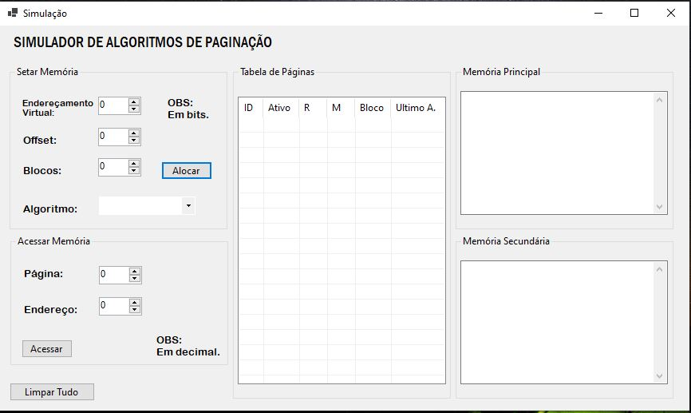

## Simulador de Algoritmos de Paginação
Este repositório possui um simulador de algoritmos de paginação.

## Interface :desktop_computer: 
 Desenvolvido em C# utilizando a ferramenta Visual Studio, a interface gráfica tem um design básico do Forms. E conta com:
 - Tabela de Páginas;
 - Memória Principal;
 - Memória Secundária;
 - Área para setar a Memória;
 - Área para acessar algum endereço na memória.
 
  
## Algoritmos :books:
### FIFO
 Neste caso mantém-se uma fila de páginas referenciadas. Ao entrar uma nova página, ela entra no fim da fila substituindo a que estava colocada no início da fila. O problema é que pode retirar páginas que apesar de estarem a muito tempo na memória, estão sendo amplamente utilizadas. Para resolver isso, utilizamos dois bits R e M e então: verifica os bits R e M da página mais antiga, se for classe 0 essa página é escolhida para ser retirada, senão, continua procurando na fila, se não achar nenhum classe 0 prossegue para as classes seguintes (1, 2 e 3).
### SEGUNDA CHANCE
  E outra solução seria o algoritmo conhecido como segunda chance: verifica o bit R da página mais velha se for zero, utiliza essa página, senão põe 0 em R e coloca a página no fim da fila e prossegue analisando a fila até encontrar uma página com R=0.
### RELÓGIO
   Uma espécie de Round-Robin para as páginas em memória. Se o bit for igual a 0, ele remove a página e o ponteiro avança para o item seguinte. Se o bit R for igual a 1, ele zera o bit R e avança o ponteiro.
### LRU
  Páginas muito utilizadas nas instruções mais recentes provavelmente permanecerão muito utilizadas nas próximas instruções e páginas não utilizadas a tempo provavelmente não serão utilizadas por bastante tempo. Esse algoritmo consiste em: quando ocorre um page fault, retira a página que a mais tempo não é referenciada. O problema é a implementação dispendiosa (manter uma lista de todas as páginas na memória – as mais recentemente utilizadas no início – e a lista deve ser alterada a cada referência na memória) e esta implementação por software é inviável em termos de tempo de execução
### NRU
  Esse método seleciona para retirar uma página que não tenha sido recentemente utilizada. Temos 2 bits associados a cada página na memória: R: indica se a página foi referenciada (lida) e M: indica se a página foi modificada (escrita). Quando é realizada uma referência à página, os bits são alterados automaticamente por hardware. Todos os bits são colocados em 0 quando uma página é carregada na memória. A cada tic tac do relógio, o SO coloca todos os bits R das páginas em 0, quando ocorre um page fault, temos as seguintes categorias de páginas:

- classe 0: R=0 e M=0
- classe 1: R=0 e M=1
- classe 2: R=1 e M=0
- classe 3: R=1 e M=1 
 
  Escolhe para ser retirada a página que pertencer a classe mais baixa, no momento da ocorrência do page fault. Vantagem é a simples implementação. Quando o hardware não possui os bits R e M, o SO pode simular esses bits através da utilização dos mecanismos de proteção de páginas, da seguinte forma: inicialmente marca-se todas as páginas como ausentes, e quando uma página é referenciada, é gerado um page fault então o SO marca essa página como presente, mas permite apenas leitura e também marca em uma tabela interna o bit R simulado para essa página. Quando uma escrita for tentada nessa página, uma interrupção de acesso inválido será gerada, e o SO poderá marcar a página como de leitura e escrita e também marca em uma tabela interna o bit M simulado para essa página.

## FEITOS :heavy_check_mark:

- [x] FIFO
- [x] SEGUNDA CHANCE
- [x] RELÓGIO
- [x] LRU
- [ ] NRU
